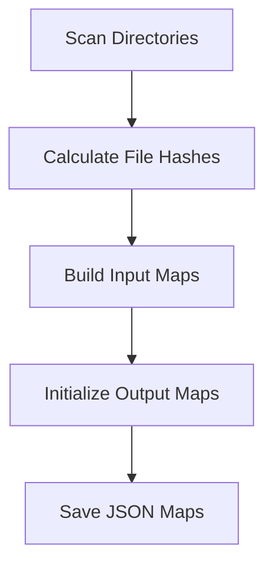

# 📋 Preprocessing Module - Gestion des Fichiers

## 🎯 Objectif

Ce module gère la **découverte et le mapping des fichiers** à traiter :
- 🗂️ **Indexation** des fichiers source
- 🔍 **Détection des changements** (nouveaux, modifiés, supprimés)
- 📊 **Tracking du progress** et évitement des retraitements
- 🗺️ **Mapping** entre fichiers d'entrée et de sortie

## 📁 Structure

```
preprocessing/
├── build_map.py          # 🏗️ Construction des mappings initiaux
├── update_map.py         # 🔄 Mise à jour et détection des changements
├── input_maps/           # 📥 Maps des fichiers d'entrée (générés)
├── vect_maps/           # 🔍 Maps pour vectorisation (générés)
└── output_maps/         # 📤 Maps des fichiers de sortie (générés)
```

## 🏗️ build_map.py - Construction Initiale

### Fonctions Principales

#### `build_pdf_man_input_map()`
Crée le mapping des PDFs ajoutés manuellement.

```python
# Structure générée :
{
  "relative/path/document.pdf": {
    "hash": "sha256_hash",
    "path": "/absolute/path/to/document.pdf"
  }
}
```

#### `compute_file_hash(path)`
Calcule le hash SHA256 d'un fichier pour détecter les modifications.

```python
hash_value = compute_file_hash("/path/to/file.pdf")
# Retourne : "a1b2c3d4e5f6..." ou None si erreur
```

### Workflow de Construction



### Types de Mappings

#### 1. PDF Manual Map
```json
{
  "MAIN/syllabus_MAIN.pdf": {
    "hash": "a1b2c3d4...",
    "path": "/srv/partage/.../syllabus_MAIN.pdf"
  },
  "MAIN/charte_bons_comportements.pdf": {
    "hash": "e5f6g7h8...",
    "path": "/srv/partage/.../charte_bons_comportements.pdf"
  }
}
```

#### 2. Data Sites Map
```json
{
  "polytech_sorbonne/json_scrapes/formation.json": {
    "hash": "x1y2z3...",
    "path": "/srv/partage/.../formation.json",
    "site": "polytech_sorbonne",
    "type": "json_scrape"
  }
}
```

## 🔄 update_map.py - Détection des Changements

### Algorithme de Détection

#### 1. Scan des Fichiers Actuels
```python
def scan_current_files():
    """Scan tous les fichiers et calcule leurs hashs"""
    current_files = {}
    for file_path in scan_directories():
        current_files[file_path] = {
            "hash": compute_file_hash(file_path),
            "last_modified": os.path.getmtime(file_path)
        }
    return current_files
```

#### 2. Comparaison avec Maps Existants
```python
def detect_changes(current_files, existing_map):
    """Détecte nouveaux, modifiés, supprimés"""
    changes = {
        "new": [],      # Nouveaux fichiers
        "modified": [], # Hash différent
        "deleted": [],  # Plus dans current_files
        "unchanged": [] # Hash identique
    }
    
    for file_path, file_info in current_files.items():
        if file_path not in existing_map:
            changes["new"].append(file_path)
        elif file_info["hash"] != existing_map[file_path]["hash"]:
            changes["modified"].append(file_path)
        else:
            changes["unchanged"].append(file_path)
    
    for file_path in existing_map:
        if file_path not in current_files:
            changes["deleted"].append(file_path)
    
    return changes
```

### Types de Changements

#### 📝 Nouveaux Fichiers
- Fichiers jamais vus auparavant
- Ajout automatique au mapping
- Marquage pour traitement

#### 🔄 Fichiers Modifiés
- Hash différent depuis dernière fois
- Mise à jour du mapping
- Retraitement nécessaire

#### ❌ Fichiers Supprimés
- Présents dans le mapping mais absents du disque
- Nettoyage du mapping
- Suppression des outputs correspondants

#### ✅ Fichiers Inchangés
- Hash identique
- Pas de retraitement nécessaire
- Skip pour optimiser performance

## 🗺️ Système de Mapping

### 📥 Input Maps
Indexent les fichiers sources par type :

```
input_maps/
├── pdf_man_map.json        # PDFs manuels
├── data_sites_map.json     # Sites scrapés
└── scraped_pdfs_map.json   # PDFs scrapés
```

### 🔍 Vect Maps
Fichiers sélectionnés pour vectorisation :

```
vect_maps/
├── selected_files.json     # Liste des fichiers à vectoriser
└── vectorization_status.json  # Statut de vectorisation
```

### 📤 Output Maps
Mapping entrée → sortie :

```
output_maps/
├── processing_results.json    # Résultats de traitement
└── validation_status.json     # Statut de validation
```

## 🚀 Workflow Complet

### 1. Construction Initiale
```bash
# Première fois : construire tous les mappings
python -c "
from preprocessing.build_map import *
build_pdf_man_input_map()
build_data_sites_input_map()
build_scraped_pdfs_input_map()
"
```

### 2. Détection des Changements
```bash
# Régulier : détecter les changements
python -c "
from preprocessing.update_map import update_all_maps
changes = update_all_maps()
print(f'Nouveaux: {len(changes[\"new\"])}')
print(f'Modifiés: {len(changes[\"modified\"])}')
"
```

### 3. Traitement Intelligent
```python
# Dans main.py
from preprocessing.update_map import get_files_to_process

# Ne traiter que les fichiers nouveaux/modifiés
files_to_process = get_files_to_process()
for file_path in files_to_process:
    process_file(file_path)
```

## 📊 Optimisations

### 1. Cache des Hashs
```python
# Éviter recalcul des hashs inchangés
hash_cache = {}

def compute_file_hash_cached(path: str) -> str:
    mtime = os.path.getmtime(path)
    cache_key = f"{path}:{mtime}"
    
    if cache_key in hash_cache:
        return hash_cache[cache_key]
    
    hash_value = compute_file_hash(path)
    hash_cache[cache_key] = hash_value
    return hash_value
```

### 2. Scan Parallèle
```python
from concurrent.futures import ThreadPoolExecutor

def parallel_file_scan(directories):
    """Scan parallèle de multiples répertoires"""
    with ThreadPoolExecutor(max_workers=4) as executor:
        futures = [
            executor.submit(scan_directory, dir_path)
            for dir_path in directories
        ]
        
        results = {}
        for future in futures:
            results.update(future.result())
        
        return results
```

### 3. Incremental Updates
```python
def incremental_update(last_scan_time):
    """Met à jour seulement les fichiers modifiés depuis last_scan_time"""
    current_time = time.time()
    
    for file_path in scan_directories():
        if os.path.getmtime(file_path) > last_scan_time:
            update_file_mapping(file_path)
    
    save_last_scan_time(current_time)
```

## 🛠️ Utilisation

### Workflow Standard
```python
from preprocessing.build_map import build_all_maps
from preprocessing.update_map import update_all_maps

# Construction initiale (première fois)
if not maps_exist():
    build_all_maps()

# Détection des changements
changes = update_all_maps()

# Traitement des changements
if changes["new"] or changes["modified"]:
    process_changed_files(changes)
```

### Integration avec Main Pipeline
```python
# main.py
def main():
    # 1. Détecter les changements
    changes = update_all_maps()
    
    # 2. Traiter seulement les changements
    files_to_process = changes["new"] + changes["modified"]
    
    if not files_to_process:
        print("Aucun fichier à traiter (pas de changements)")
        return
    
    # 3. Pipeline normal sur fichiers modifiés
    process_files(files_to_process)
```

## 📊 Métriques et Monitoring

### Statistiques Utiles
```python
def generate_stats():
    """Génère des statistiques sur les mappings"""
    stats = {
        "total_files": count_total_files(),
        "by_type": count_files_by_type(),
        "by_status": count_files_by_status(),
        "storage_size": calculate_total_size(),
        "last_update": get_last_update_time()
    }
    return stats
```

### Dashboard Simple
```python
def print_dashboard():
    """Affiche un dashboard des mappings"""
    stats = generate_stats()
    
    print("📊 Preprocessing Dashboard")
    print(f"Total Files: {stats['total_files']}")
    print(f"PDFs Manual: {stats['by_type']['pdf_manual']}")
    print(f"JSONs Scraped: {stats['by_type']['json_scraped']}")
    print(f"Last Update: {stats['last_update']}")
```

## 🎯 Bonnes Pratiques

1. **🔄 Incremental** : Toujours privilégier les mises à jour incrémentales
2. **🛡️ Robustesse** : Gérer les erreurs de lecture/écriture de fichiers
3. **📊 Monitoring** : Logger les changements détectés
4. **⚡ Performance** : Utiliser le parallélisme pour gros volumes
5. **🧹 Cleanup** : Nettoyer régulièrement les mappings obsolètes
