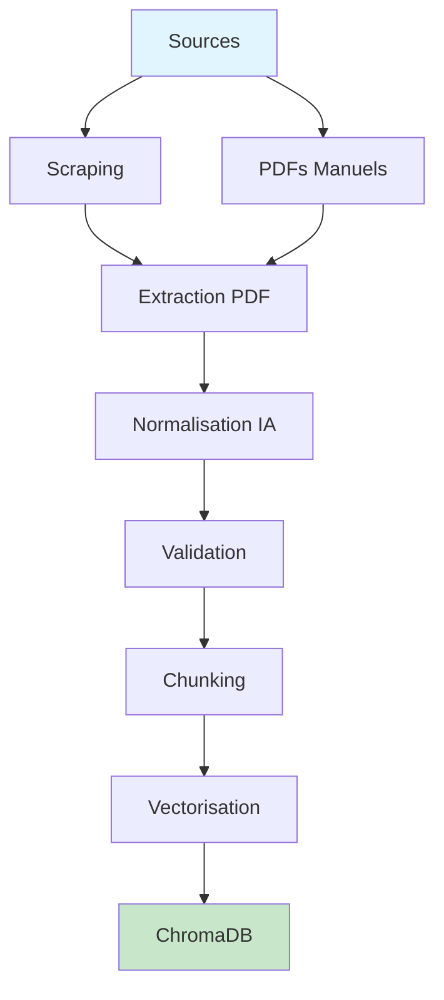
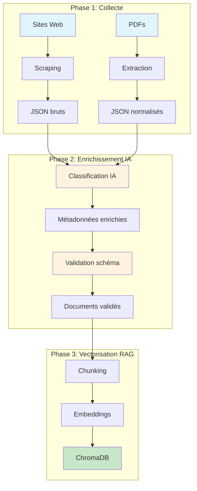
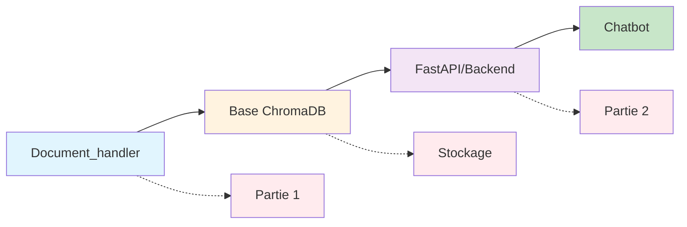

# Document Handler - Pipeline de Préparation RAG

## Vue d'ensemble

Le module `Document_handler` constitue la **première partie fondamentale** du projet de chatbot Polytech. Il implémente un pipeline complet de préparation de données RAG (Retrieval-Augmented Generation) qui transforme des sources documentaires hétérogènes en une base de données vectorielle optimisée pour la recherche sémantique.

### Pipeline Complet



## Architecture Générale

```
Document_handler/
│
├── The_handler.py          # API FastAPI - Points d'entrée
│
├── scraping/               # Collecte automatique de données
│   ├── scraping_tool/      # Outils de scraping configurables
│   ├── tools/              # Gestion des configurations
│   └── logs/               # Journaux de scraping
│
├── new_filler/             # Pipeline de traitement intelligent
│   ├── graph/              # Orchestration LangGraph
│   ├── logic/              # Logique métier IA
│   ├── preprocessing/      # Gestion des fichiers et mappings
│   ├── Vectorisation/      # Préparation RAG et chunking
│   ├── prompts/            # Templates IA pour classification
│   ├── utils/              # Utilitaires communs
│   ├── schema/             # Schémas de validation JSON
│   ├── progress/           # Suivi des traitements
│   └── main.py             # Point d'entrée principal
│
└── Corpus/                 # Stockage des données
    ├── data_sites/         # Sites scrapés
    ├── pdf_man/            # PDFs manuels
    ├── json_normalized/    # Documents traités
    └── test/               # Données de test
```

## Fonctionnalités Principales

### 1. **Scraping Intelligent**
- **Configuration dynamique** des sites à scraper via YAML
- **Détection des modifications** pour mise à jour incrémentale
- **Archivage automatique** des anciennes configurations
- **Logs détaillés** pour monitoring et debugging

### 2. **Traitement PDF Avancé**
- **Extraction multiformat** (PDFs manuels + scrapés)
- **Traitement spécialisé syllabus** avec structure hiérarchique
- **Métadonnées enrichies** automatiquement par IA
- **Classification automatique** selon le type de document

### 3. **Enrichissement IA via LangGraph**
- **Orchestration intelligente** des workflows de traitement
- **Détection automatique du type** de document
- **Génération de métadonnées** manquantes
- **Validation par schéma** JSON strict avec fallback

### 4. **Vectorisation RAG Optimisée**
- **Chunking intelligent** adapté au type de contenu
- **Embeddings OpenAI** pour recherche sémantique
- **Stockage ChromaDB** avec persistance et métadonnées
- **Déduplication automatique** des doublons

## Flux de Données Détaillé



## API FastAPI - Points d'Entrée

Le fichier `The_handler.py` expose les endpoints suivants :

### Monitoring
- `GET /site_infos` - Informations des sites configurés
- Statistiques de scraping et nouvelles données

### Scraping
- `POST /scraping` - Lancer le scraping des sites configurés
- `POST /add_site` - Ajouter un nouveau site à scraper
- `POST /supp_site` - Archiver un site existant

### Processing
- `POST /files_normalization` - Normalisation des fichiers via LangGraph
- `POST /vectorization` - Vectorisation pour RAG avec ChromaDB

## Composants Détaillés

### Module Scraping
**Objectif** : Collecte automatique et configurable de données web

- **Configuration YAML** pour chaque site avec sélecteurs CSS
- **Détection des modifications** avec timestamps et archivage
- **Gestion des erreurs** robuste avec retry automatique
- **Logs rotatifs** pour monitoring et debugging

**Usage** :
```python
from scraping.scraping_tool.scraping_script import run_scraping_from_configs
run_scraping_from_configs(['polytech_sorbonne.yaml'])
```

### Module New Filler
**Objectif** : Pipeline intelligent orchestré par LangGraph

#### Graph (LangGraph)
- **Orchestration** du workflow avec nœuds conditionnels
- **Gestion d'erreurs** robuste avec états de fallback
- **Traçabilité** complète des exécutions
- **Parallélisation** des tâches indépendantes

#### Logic
- **Classification automatique** des types de documents
- **Enrichissement IA** des métadonnées manquantes
- **Validation** selon schéma JSON Polytech
- **Algorithmes de ranking** pour priorisation

#### Preprocessing
- **Mapping intelligent** des fichiers sources
- **Détection incrémentale** des changements
- **Cache des hashs** pour éviter les retraitements
- **Gestion des dépendances** entre fichiers

#### Vectorisation
- **Chunking adaptatif** selon le type et la taille du contenu
- **Métadonnées enrichies** pour filtrage avancé
- **Stockage ChromaDB** optimisé avec collections séparées
- **Déduplication** basée sur le contenu et les métadonnées

## Modules Connexes

### Pipeline RAG Complet


### Documentation des Modules
- [New Filler](new_filler/README.md) - Pipeline principal orchestré
- [Graph](new_filler/graph/README.md) - Orchestration LangGraph  
- [Logic](new_filler/logic/README.md) - Logique métier IA
- [Vectorisation](new_filler/Vectorisation/README.md) - Préparation RAG
- [Preprocessing](new_filler/preprocessing/README.md) - Gestion fichiers
- [Scraping](scraping/README.md) - Collecte de données web

### Fichiers de Configuration
- [Schema](new_filler/schema/) - Schémas de validation JSON
- [Prompts](new_filler/prompts/) - Templates pour IA
- [Utils](new_filler/utils/) - Utilitaires communs

---
*Module Document Handler intégré au chatbot Polytech (juillet 2025).*
