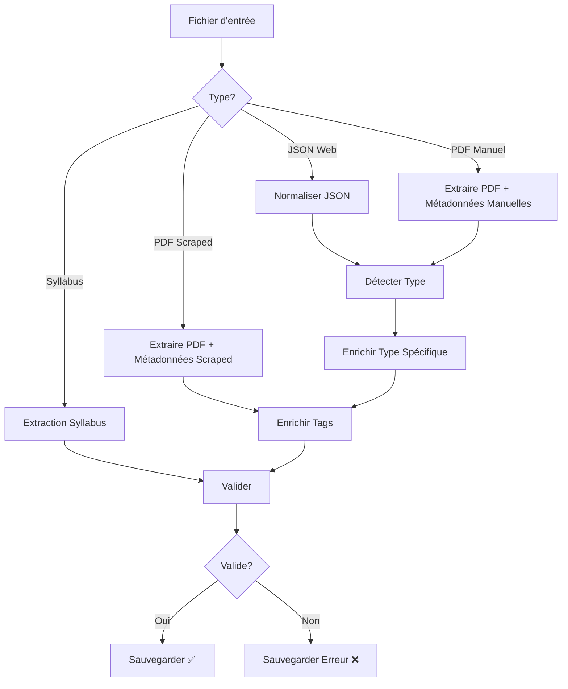

 # 🔄 New Filler - Pipeline de Traitement de Documents

**Statut**: ✅ **Projet terminé**  
**Version**: 1.0  
**Date**: Juillet 2025

## 🎯 Vue d'ensemble

Le module `new_filler` est un pipeline de traitement de documents intelligent qui :
- 📄 **Traite** des PDFs et JSONs de différentes sources
- 🤖 **Enrichit** automatiquement les métadonnées via IA
- ✅ **Valide** selon un schéma uniforme
- 🗂️ **Normalise** la structure des données
- 🔗 **Prépare** pour la vectorisation RAG

## 🏗️ Architecture

```
new_filler/
│
├── 📊 QUALITY_REPORT.md    # Rapport de qualimétrie détaillé
├── 🎯 main.py             # Point d'entrée principal
├── ⚙️ config.py           # Configuration centralisée
├── 🔧 draw_graph.py       # Visualisation du pipeline
│
├── graph/                 # 🕸️ Pipeline LangGraph
│   ├── nodes.py          # Nœuds de traitement
│   ├── branches.py       # Logique de branchement
│   └── build_graph.py    # Construction du graphe
│
├── logic/                # 🧠 Logique métier
│   ├── fill_logic.py     # Enrichissement automatique
│   ├── detect_type.py    # Classification de documents
│   ├── webjson.py        # Normalisation JSON web
│   ├── load_pdf.py       # Extraction PDF
│   ├── syllabus.py       # Traitement syllabus
│   └── chunck_syll.py    # Chunking intelligent
│
├── utils/                # 🛠️ Utilitaires
│   └── ollama_wrapper.py # Interface IA (OpenAI/Ollama)
│
├── preprocessing/        # 📋 Gestion des fichiers
│   ├── build_map.py      # Cartographie des sources
│   └── update_map.py     # Mise à jour des mappings
│
├── Vectorisation/        # 🔍 Préparation RAG
│   └── vectorisation_chunk.py  # Chunking et vectorisation
│
├── prompts/             # 💬 Templates IA
├── schema/              # 📝 Schémas de validation
└── README_*.md          # 📚 Documentation détaillée
```

## 🚀 Utilisation

### Exécution complète
```bash
cd /srv/partage/Stage-Chatbot-Polytech/Document_handler/Pdf_handler
python -m new_filler.main
```

### Visualisation du pipeline
```bash
python -m new_filler.draw_graph
# Génère: rag_graph.png
```

## 📊 Pipeline de Traitement



## ⚙️ Configuration

### Variables d'environnement
```env
OPENAI_API_KEY=your_openai_key
```

### Paramètres principaux
```python
# config.py
OLLAMA_MODEL = "mistral"
OPENAI_MODEL = "gpt-4o-mini"
INPUT_DIR = CORPUS_DIR / "test"
VALID_DIR = CORPUS_DIR / "json_normalized" / "validated"
```

## 📈 Métriques de Qualité

- **Architecture**: 9/10 - Modulaire et extensible
- **Robustesse**: 8/10 - Gestion d'erreurs complète
- **Performance**: 7/10 - Parallélisation efficace
- **Documentation**: 5/10 - En cours d'amélioration

**Score Global**: 7.1/10 🟡

➡️ **Voir le rapport détaillé**: [QUALITY_REPORT.md](QUALITY_REPORT.md)

## 🔗 Liens Utiles

- [Documentation Graph](graph/README.md)
- [Documentation Logic](logic/README.md)
- [Documentation Vectorisation](Vectorisation/README.md)
- [Guide de Contribution](CONTRIBUTING.md)