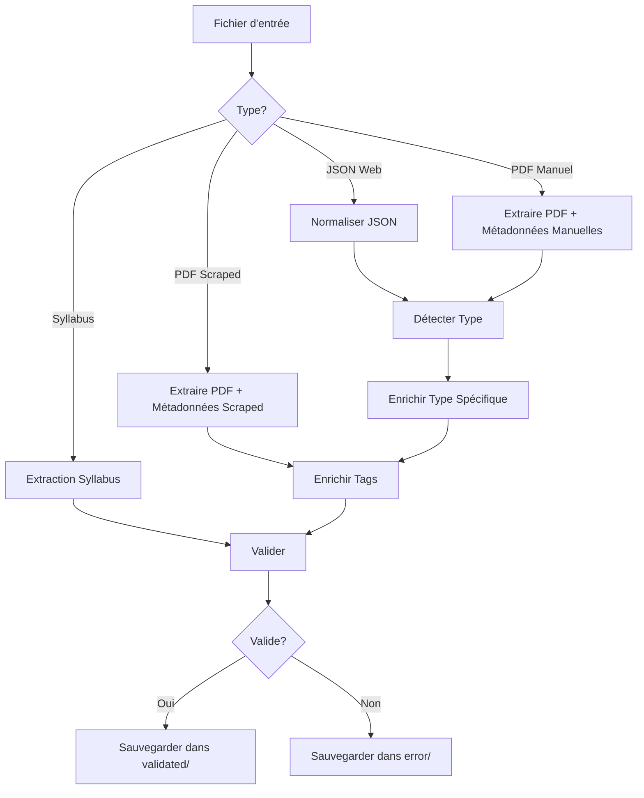

 # Module New Filler - Pipeline de Traitement de Documents

## Vue d'ensemble

Le module `new_filler` fait partie intégrante du système RAG Polytech et constitue l'étape de traitement intermédiaire qui :
- Traite des PDFs et JSONs de différentes sources (scraping, upload manuel)
- Enrichit automatiquement les métadonnées via IA (OpenAI/Ollama)
- Valide selon un schéma uniforme pour le système RAG
- Normalise la structure des données avant vectorisation
- Prépare les documents pour l'indexation dans ChromaDB

## Architecture du module

```
new_filler/
│
├── QUALITY_REPORT.md      # Rapport de qualimétrie détaillé
├── main.py               # Point d'entrée principal
├── config.py             # Configuration centralisée
├── draw_graph.py         # Visualisation du pipeline
│
├── graph/                # Pipeline LangGraph
│   ├── nodes.py          # Nœuds de traitement
│   ├── branches.py       # Logique de branchement
│   └── build_graph.py    # Construction du graphe
│
├── logic/                # Logique métier
│   ├── fill_logic.py     # Enrichissement automatique
│   ├── detect_type.py    # Classification de documents
│   ├── webjson.py        # Normalisation JSON web
│   ├── load_pdf.py       # Extraction PDF
│   ├── syllabus.py       # Traitement syllabus
│   └── chunck_syll.py    # Chunking intelligent
│
├── utils/                # Utilitaires
│   └── ollama_wrapper.py # Interface IA (OpenAI/Ollama)
│
├── preprocessing/        # Gestion des fichiers
│   ├── build_map.py      # Cartographie des sources
│   └── update_map.py     # Mise à jour des mappings
│
├── Vectorisation/        # Préparation RAG
│   └── vectorisation_chunk.py  # Chunking et vectorisation
│
├── prompts/             # Templates IA
├── schema/              # Schémas de validation
└── README_*.md          # Documentation détaillée
```

## Utilisation

### Exécution complète
```bash
cd /srv/partage/Stage-Chatbot-Polytech/Document_handler/Pdf_handler
python -m new_filler.main
```

### Visualisation du pipeline
```bash
python -m new_filler.draw_graph
# Génère: rag_graph.png
```

## Pipeline de traitement



## Configuration

### Variables d'environnement
```env
OPENAI_API_KEY=your_openai_key
```

### Paramètres principaux
```python
# config.py
OLLAMA_MODEL = "mistral"
OPENAI_MODEL = "gpt-4o-mini"
VALID_DIR = CORPUS_DIR / "json_normalized" / "validated"
```

## Liens utiles

- [Documentation Graph](graph/README.md)
- [Documentation Logic](logic/README.md)
- [Documentation Vectorisation](Vectorisation/README.md)
---
*Module intégré au système RAG Polytech - Pipeline de traitement intermédiaire (juillet 2025).*