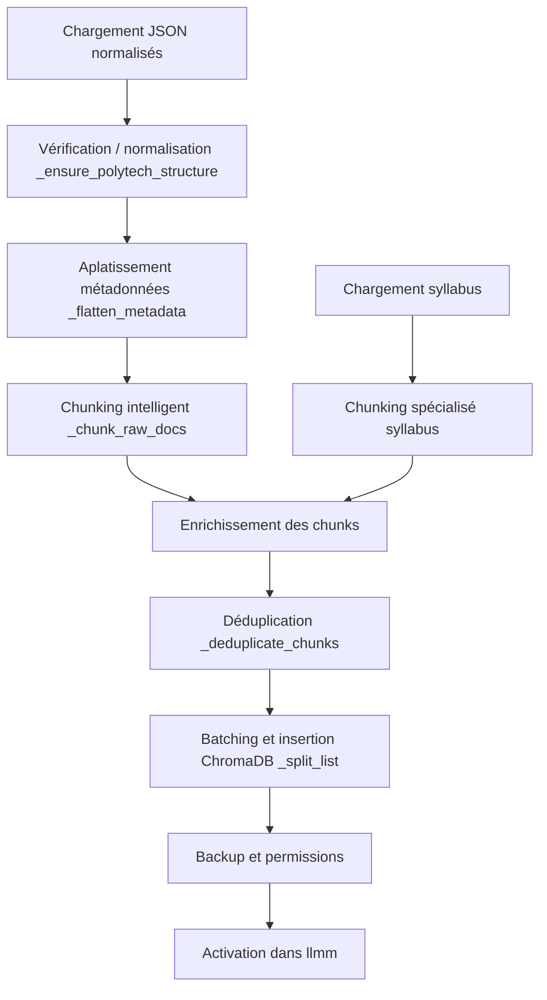

# Module de Vectorisation RAG - Documentation

## Objectif
Préparer et indexer des documents st## Bonnes pratiques et recommandations
- Traiter par batchs de 100 documents (BATCH_SIZE)
- Toujours valider la qualité des chunks générés
- Tracker les métriques de chunking et d'indexation
- Implémenter la déduplication avant la mise en production
- Utiliser le cache d'embeddings si possible
- Vérifier les permissions d'écriture sur les dossiers
- Sauvegarde automatique des anciens vectorstores (max 10) pour la recherche RAG (Retrieval Augmented Generation) :
- Découpage intelligent en chunks (1500c, overlap 150)
- Aplatissement et enrichissement des métadonnées
- Stockage vectoriel dans ChromaDB
- Déduplication, sauvegarde, monitoring, backup automatiqueisation RAG - Documentation

## Structure du module
```
Vectorisation/
├── vectorisation_chunk_dev.py     # Pipeline principal (dev)
├── vectorstore_Syllabus/          # Base ChromaDB générée
│   ├── chroma.sqlite3
│   └── ...
├── vectorstore_backup/            # Backups automatiques
└── ...
```

## Pipeline de transformation



## Fonctions principales
- `_load_json_docs()` : charge tous les JSON normalisés (hors syllabus)
- `_load_syllabus_json_docs()` : charge les syllabus
- `_ensure_polytech_structure(doc)` : normalise le schéma Polytech
- `_flatten_metadata(md)` : aplatit les métadonnées imbriquées
- `_chunk_raw_docs(raw_docs)` : découpe en chunks (text splitter)
- `_syllabus_to_lc_docs(syllabus_raw)` : chunking spécialisé syllabus
- `_split_list(data, size)` : batching pour Chroma
- `_backup_existing_vectorstore()` : backup auto, rotation
- `build_vectorstore()` : pipeline complet (voir ci-dessous)

## Exemple d'utilisation (pipeline complet)
```python
from Vectorisation.vectorisation_chunk_dev import build_vectorstore

res = build_vectorstore()
if res["status"] == "success":
    print(res["message"])
else:
    print(f"❌ {res['message']}")
```

## Recherche et filtres
```python
from langchain_chroma import Chroma
from langchain_openai import OpenAIEmbeddings
from pathlib import Path

VECTORSTORE_DIR = Path(__file__).parent / "vectorstore_Syllabus"
embeddings = OpenAIEmbeddings()
db = Chroma(persist_directory=str(VECTORSTORE_DIR), embedding_function=embeddings)

# Recherche sémantique simple
results = db.similarity_search("table des matières", k=5)
for doc in results:
    print(doc.page_content, doc.metadata)

# Recherche avec filtres
results = db.similarity_search(
    "cours mathematiques",
    k=10,
    filter={"document_type": "cours", "metadata.niveau": "Semestre 6"}
)
```

### Filtres disponibles
- `document_type` : cours, administratif, vie_etudiante, etc.
- `metadata.niveau` : Semestre 5, Semestre 6, etc.
- `metadata.specialite` : MAIN, GI, etc.
- `source.site` : polytech_sorbonne, etc.
- `tags` : mots-clés automatiques

## Bonnes pratiques & recommandations
- Traiter par batchs de 100 documents (BATCH_SIZE)
- Toujours valider la qualité des chunks générés
- Tracker les métriques de chunking et d’indexation
- Implémenter la déduplication avant la mise en production
- Utiliser le cache d’embeddings si possible
- Vérifier les permissions d’écriture sur les dossiers
- Sauvegarde automatique des anciens vectorstores (max 10)

## Optimisations possibles
1. Cache des embeddings pour éviter les recalculs
2. Traitement par batchs et indexation parallèle
3. Compression des métadonnées
4. Monitoring de la progression (progress.json)
5. Nettoyage automatique des backups anciens

---
*Documentation alignée sur vectorisation_chunk_dev.py (juillet 2025).*