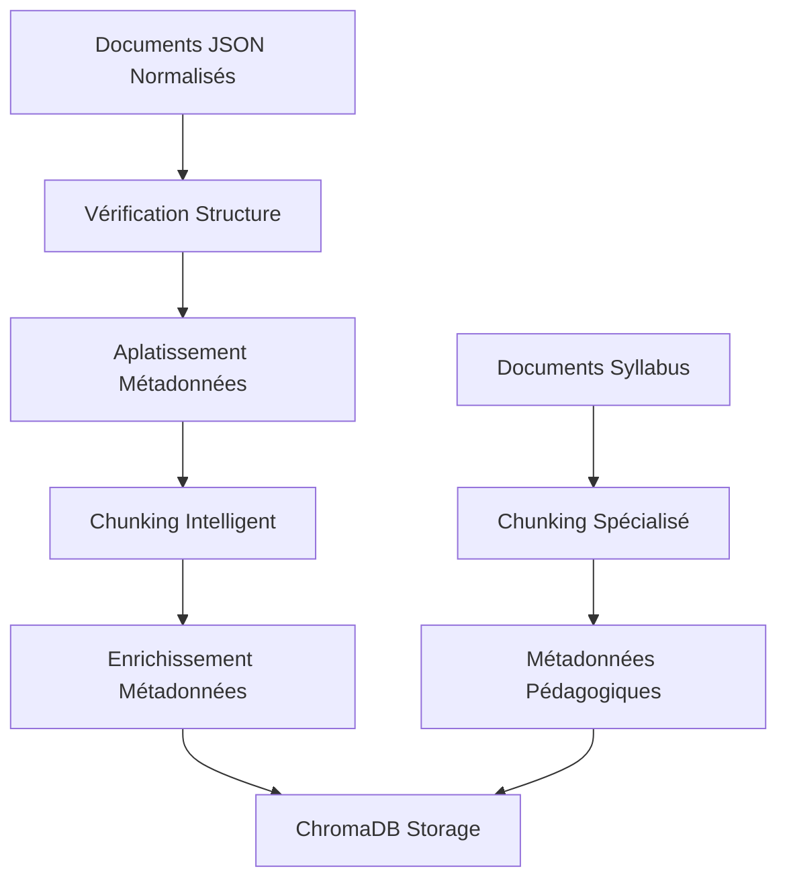

# 🔍 Vectorisation Module - Préparation RAG

## 🎯 Objectif

Ce module prépare les documents normalisés pour la **recherche RAG** en :
- ✂️ **Découpant** intelligemment les documents
- 🔗 **Enrichissant** les métadonnées pour la recherche
- 🗃️ **Stockant** dans ChromaDB pour l'indexation vectorielle
- 🚫 **Déduplicant** pour éviter la pollution de la base

## 📁 Structure

```
Vectorisation/
├── vectorisation_chunk.py    # 🚀 Pipeline principal de vectorisation
└── vectorstore_Syllabus/     # 🗃️ Base ChromaDB (générée)
    ├── chroma.sqlite3
    └── ... (métadonnées ChromaDB)
```

## 🚀 vectorisation_chunk.py - Pipeline Principal

### Fonctions Principales

#### `load_normalized_docs()`
Charge tous les documents JSON normalisés depuis le dossier validé.

```python
docs = load_normalized_docs()
# Retourne : List[Dict] - Documents JSON normalisés
```

#### `load_syllabus_docs()`
Charge spécifiquement les documents syllabus (pattern `syllabus*.json`).

```python
syllabus_docs = load_syllabus_docs()
# Retourne : List[Dict] - Documents syllabus uniquement
```

#### `convert_to_documents(raw_docs)`
Convertit les documents JSON en objets LangChain Document avec chunking.

```python
langchain_docs = convert_to_documents(normalized_docs)
# Retourne : List[Document] - Prêts pour ChromaDB
```

#### `ensure_polytech_structure(doc)`
Normalise la structure pour respecter le schéma Polytech.

```python
normalized = ensure_polytech_structure(raw_doc)
# Garantit : document_type, metadata, source, content, tags
```

### Pipeline de Transformation



## ✂️ Stratégie de Chunking

### Configuration par Défaut
```python
splitter = RecursiveCharacterTextSplitter(
    chunk_size=500,        # Taille optimale pour embeddings
    chunk_overlap=50       # Préservation du contexte
)
```

### Chunking Intelligent
1. **Respect du contenu** : Évite de couper au milieu des phrases
2. **Taille optimisée** : 500 caractères = ~100 tokens (optimal pour embeddings)
3. **Chevauchement** : 50 caractères pour maintenir le contexte
4. **Filtrage** : Ignore les chunks vides ou trop courts

## 🏷️ Enrichissement des Métadonnées

### Aplatissement Automatique
Les métadonnées complexes sont aplaties pour ChromaDB :

```python
# Structure originale
{
  "metadata": {"title": "Cours IA"},
  "source": {"site": "polytech", "url": "..."}
}

# Structure aplatie
{
  "metadata.title": "Cours IA",
  "source.site": "polytech",
  "source.url": "..."
}
```

### Métadonnées Enrichies par Chunk
Chaque chunk hérite de :
- **Métadonnées du document parent**
- **Informations de source** (chemin, site, catégorie)
- **Tags automatiques** (générés par IA)
- **Type de document** (cours, administratif, etc.)
- **Métadonnées spécialisées** (niveau, spécialité, etc.)

## 🗃️ Stockage ChromaDB

### Configuration
```python
VECTORSTORE_DIR = Path(__file__).parent / "vectorstore_Syllabus"
embeddings = OpenAIEmbeddings()
db = Chroma(persist_directory=str(VECTORSTORE_DIR), embedding_function=embeddings)
```

### Structure de la Base
- **Documents** : Chunks de contenu
- **Métadonnées** : Informations structurées pour filtrage
- **Embeddings** : Vecteurs OpenAI pour recherche sémantique
- **IDs** : Identifiants uniques par chunk

## 🚫 Gestion des Doublons

### Problème Identifié
Le système peut créer des doublons lors de :
- Retraitement du même document
- Sources multiples pour le même contenu
- Erreurs de pipeline

### Solution Recommandée
```python
def deduplicate_chunks(chunks):
    """Déduplication par hash de contenu"""
    seen = set()
    unique_chunks = []
    
    for chunk in chunks:
        content_hash = hashlib.md5(chunk.page_content.encode()).hexdigest()
        if content_hash not in seen:
            seen.add(content_hash)
            unique_chunks.append(chunk)
    
    return unique_chunks
```

## 🔍 Recherche et Filtrage

### Exemple de Recherche
```python
# Recherche sémantique
results = db.similarity_search(
    "table des matières semestre 6",
    k=5
)

# Recherche avec filtre
results = db.similarity_search(
    "cours mathematiques",
    k=10,
    filter={"document_type": "cours", "metadata.niveau": "Semestre 6"}
)
```

### Filtres Disponibles
- **document_type** : cours, administratif, vie_etudiante, etc.
- **metadata.niveau** : Semestre 5, Semestre 6, etc.
- **metadata.specialite** : MAIN, GI, etc.
- **source.site** : MAIN, polytech_sorbonne, etc.
- **tags** : mots-clés automatiques

## 📊 Métriques de Performance

### Statistiques Typiques
- **Documents traités** : ~300-500 par batch
- **Chunks générés** : ~3-5 par document
- **Taille moyenne chunk** : 350-450 caractères
- **Temps de traitement** : ~2-3s par document

### Optimisations Possibles
1. **Cache des embeddings** pour éviter recalcul
2. **Batch processing** pour réduire les appels API
3. **Indexation parallèle** pour gros volumes
4. **Compression des métadonnées** pour optimiser l'espace

## 🛠️ Utilisation

### Pipeline Complet
```python
from Vectorisation.vectorisation_chunk import (
    load_normalized_docs, 
    convert_to_documents
)

# 1. Charger les documents
docs = load_normalized_docs()

# 2. Convertir en chunks LangChain
chunks = convert_to_documents(docs)

# 3. Stocker dans ChromaDB
db = Chroma.from_documents(
    chunks, 
    embeddings, 
    persist_directory=str(VECTORSTORE_DIR)
)
```

### Recherche Simple
```python
# Rechercher des TOCs
results = db.similarity_search("table des matières", k=5)
for doc in results:
    print(f"Contenu: {doc.page_content}")
    print(f"Source: {doc.metadata.get('source.site')}")
```

## 🎯 Recommandations

1. **🚀 Performance** : Traiter par batch de 50-100 documents
2. **🔍 Qualité** : Valider que les chunks préservent le sens
3. **📊 Monitoring** : Tracker les métriques de chunking
4. **🚫 Déduplication** : Implémenter avant mise en production
