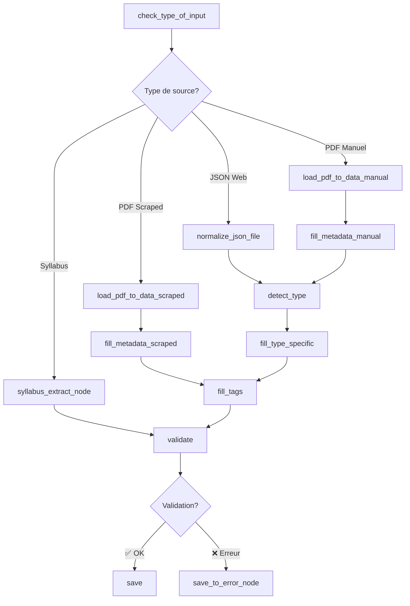

# 🕸️ Graph Module - Pipeline LangGraph

## 🎯 Objectif

Ce module implémente l'orchestration du pipeline de traitement via **LangGraph**, permettant un flux de données robuste et configurable entre les différentes étapes de traitement.

## 📁 Structure

```
graph/
├── nodes.py          # 🔧 Nœuds de traitement
├── branches.py       # 🔀 Logique de branchement conditionnel
└── build_graph.py    # 🏗️ Construction et compilation du graphe
```

## 🔧 Nœuds Disponibles

### 📥 Nœuds d'Entrée
- **`check_type_of_input_node`** : Détermine le type de source (web, PDF, syllabus)
- **`load_json_node`** : Charge un fichier JSON
- **`normalize_json_file_node`** : Normalise les JSONs web scrapés

### 📄 Nœuds de Traitement PDF
- **`load_pdf_to_data_manual_node`** : Traite les PDFs ajoutés manuellement
- **`load_pdf_to_data_scraped_node`** : Traite les PDFs scrapés
- **`syllabus_extract_node`** : Extraction spécialisée pour syllabus

### 🤖 Nœuds d'Enrichissement IA
- **`detect_type_node`** : Classification automatique du type de document
- **`fill_metadata_manual_node`** : Enrichit métadonnées pour PDFs manuels
- **`fill_metadata_scraped_node`** : Enrichit métadonnées pour PDFs scrapés
- **`fill_tags_node`** : Génère des tags automatiquement
- **`fill_type_specific_node`** : Enrichit selon le type détecté

### ✅ Nœuds de Validation et Sauvegarde
- **`validate_node`** : Valide selon le schéma JSON
- **`save_node`** : Sauvegarde dans le dossier validé
- **`save_to_error_node`** : Sauvegarde les erreurs

## 🔀 Flux de Données

### Structure d'État (FillerState)
```python
class FillerState(TypedDict):
    file_path: str      # Chemin du fichier source
    data: Any          # Données brutes extraites
    output_data: Any   # Données normalisées/enrichies
    is_valid: bool     # Résultat de validation
    web_page: bool     # Flag: source web
    pdf_scraped: bool  # Flag: PDF scrapé
    is_syllabus: bool  # Flag: syllabus détecté
    processed: bool    # Flag: traitement terminé
    error: str         # Message d'erreur
    traceback: str     # Stack trace détaillée
```

### Graphe de Flux


## 🛠️ Utilisation

### Construction du Graphe
```python
from graph.build_graph import build_graph

# Construire et compiler le graphe
graph = build_graph()

# Exécuter sur un fichier
state = {"file_path": "/path/to/document.pdf"}
result = graph.invoke(state)
```

### Ajout d'un Nouveau Nœud
```python
# 1. Définir la fonction du nœud dans nodes.py
def my_custom_node(state):
    # Traitement personnalisé
    state["custom_field"] = "processed"
    return state

# 2. Ajouter au graphe dans build_graph.py
graph.add_node("my_custom", my_custom_node)
graph.add_edge("previous_node", "my_custom")
```

## 🔍 Debugging

### Logs de Traçage
Chaque nœud utilise `log_callback` pour tracer l'exécution :
```python
def log_callback(state, msg):
    print(f"[{msg}] {state.get('file_path', '')}")
```

### Gestion d'Erreurs
```python
try:
    # Traitement du nœud
    result = process_data(state["data"])
    state["output_data"] = result
except Exception as e:
    state["error"] = f"Node error: {e}"
    state["traceback"] = traceback.format_exc()
    raise
```

## 🚀 Avantages de LangGraph

1. **🔄 Flux Conditionnels** : Branchement intelligent selon le contexte
2. **🛡️ Robustesse** : Gestion d'erreurs intégrée
3. **📊 Observabilité** : Traçage automatique des exécutions
4. **🔧 Extensibilité** : Ajout facile de nouveaux nœuds
5. **⚡ Performance** : Exécution optimisée des dépendances
