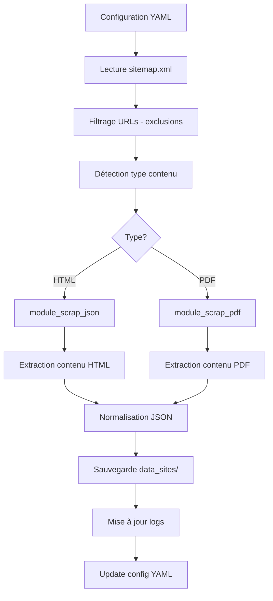

# Module de Scraping Web - Documentation

## Objectif
Module de scraping automatisé pour extraire et traiter les contenus web des sites éducatifs :
- Scraping basé sur sitemap.xml et configuration YAML
- Extraction de contenus HTML et PDF
- Gestion des exclusions et filtres
- Logging et monitoring des modifications
- Archivage automatique des configurations

## Structure du module
```
scraping/
├── __init__.py
├── logs/                          # Logs de scraping par site
│   └── archives/
├── scraping_tool/                 # Pipeline principal de scraping
│   ├── __init__.py
│   ├── scraping_script.py         # Script principal
│   ├── config_sites/              # Configurations YAML par site
│   │   └── config_archives/
│   ├── progress/                  # Suivi de progression
│   └── src/                       # Modules spécialisés
│       ├── module_scrap_json.py   # Scraping HTML → JSON
│       ├── module_scrap_pdf.py    # Scraping PDF → JSON
│       ├── scraper_utils.py       # Utilitaires de scraping
│       └── test_module_scrap_json.py
└── tools/                         # Outils de gestion
    ├── manage_config.py           # Gestion des configs YAML
    └── config_template.yaml       # Template de configuration
```

## Pipeline de scraping



## Configuration des sites

### Template de configuration (config_template.yaml)
```yaml
NAME: "{NAME}"
BASE_URL: "{BASE_URL}"
SITEMAP_URL: "{SITEMAP_URL}"
EXCLUDE_URL_KEYWORDS:
  - "/actualites/"
  - "/acces-refuse/"
  - "/brouillon"
  - "/test"
  - "newsletter"
LAST_MODIFIED_DATE: null
```

### Génération automatique
```python
from tools.manage_config import generate_config

# Génère une config pour un nouveau site
generate_config("polytech_sorbonne", "https://polytech.sorbonne-universite.fr")
```

## Modules de scraping

### module_scrap_json.py
- Scraping des pages HTML
- Extraction du contenu textuel
- Nettoyage et normalisation
- Génération de métadonnées

### module_scrap_pdf.py
- Scraping des fichiers PDF
- Extraction de texte via OCR/parsing
- Préservation de la structure
- Métadonnées spécialisées

### scraper_utils.py
- Utilitaires communs de scraping
- Gestion des dates de modification
- Validation des URLs
- Comptage des pages modifiées

## Utilisation

### Scraping d'un site complet
```python
from scraping_tool.scraping_script import main

# Lance le scraping avec configuration
main("polytech_sorbonne.yaml")
```

### Gestion des configurations
```python
from tools.manage_config import generate_config, archive_config

# Créer une nouvelle configuration
generate_config("nouveau_site", "https://exemple.fr")

# Archiver une configuration existante
archive_config("ancien_site")
```

## Fonctionnalités

### Filtrage intelligent
- Exclusion par mots-clés d'URL
- Détection automatique du type de contenu
- Respect des robots.txt
- Gestion des timeouts et erreurs

### Monitoring et logs
- Logs détaillés par site (logs/site_name.txt)
- Suivi des modifications (LAST_MODIFIED_DATE)
- Comptage des pages traitées
- Gestion des erreurs et retry

### Archivage
- Archivage automatique des anciennes configs
- Sauvegarde des données scrapées
- Rotation des logs
- Nettoyage automatique

## Sortie des données

### Structure JSON générée
```json
{
  "document_type": "page_web",
  "metadata": {
    "title": "Titre de la page",
    "description": "Description...",
    "date_scraping": "2025-07-28T10:30:00Z"
  },
  "source": {
    "url": "https://exemple.fr/page",
    "site": "exemple",
    "category": "scrapping"
  },
  "content": "Contenu extrait...",
  "tags": ["tag1", "tag2"]
}
```

### Dossiers de sortie
- `Corpus/data_sites/site_name/` : Données scrapées
- `logs/site_name.txt` : Logs de scraping
- `scraping_tool/config_sites/site_name.yaml` : Configuration

## Bonnes pratiques

- Configurer les exclusions pour éviter le contenu non pertinent
- Surveiller les logs pour détecter les erreurs
- Archiver régulièrement les anciennes configurations
- Respecter les délais entre requêtes (rate limiting)
- Valider la qualité des données extraites

## Dépendances

- `ruamel.yaml` : Gestion des configurations YAML
- `requests` : Requêtes HTTP
- `beautifulsoup4` : Parsing HTML
- `PyPDF2` : Extraction PDF
- `color_utils` : Affichage coloré

---
*Module de scraping intégré au pipeline RAG Polytech (juillet 2025).*
