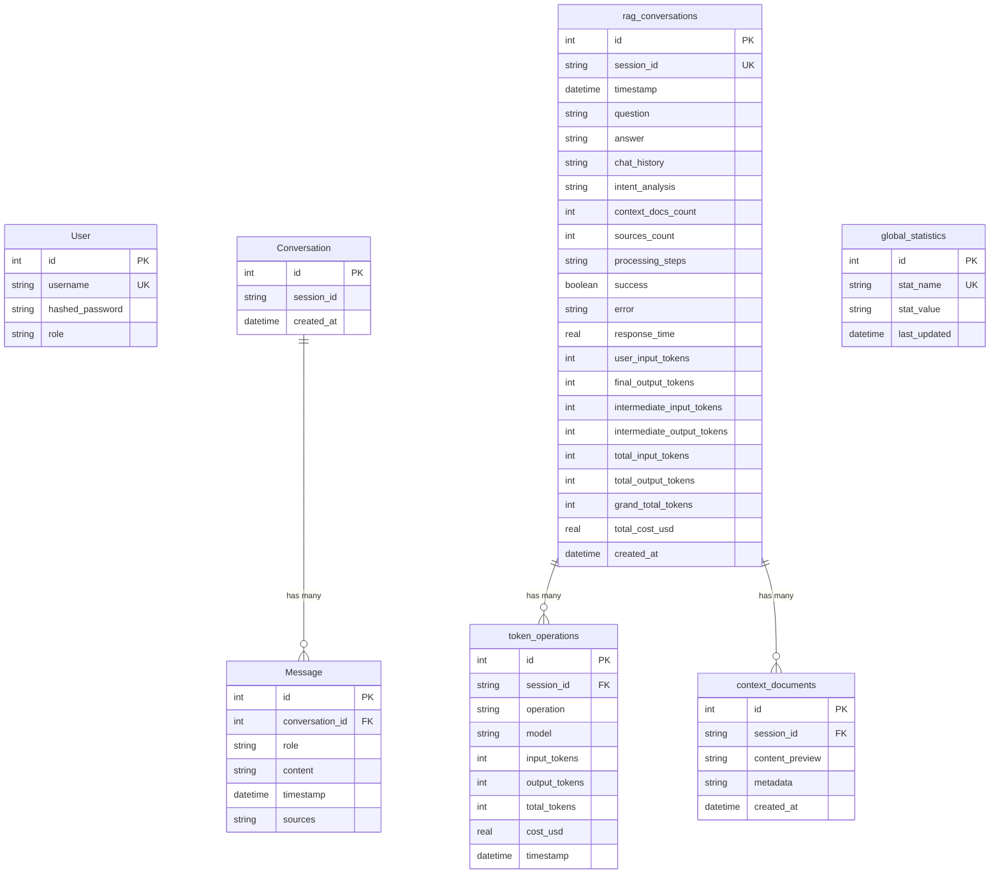

# Architecture de la Base de Données Unifiée

## Vue d'ensemble

Le système utilise une base de données SQLite unifiée qui combine :
- **Système d'authentification** (SQLModel)
- **Système de chat/conversations** (SQLModel) 
- **Système RAG intelligent** (SQLite natif)

## Diagramme des Relations



## Architecture des Fichiers

### 1. Tables SQLModel (créées par SQLAlchemy/SQLModel)

#### **Fichier : `app/database/models.py`**
- **Table `user`** : Authentification et autorisation
- **Note** : Gérée par SQLModel, utilise l'ORM

#### **Fichier : `app/chat_models.py`**
- **Table `conversation`** : Conversations anonymes
- **Table `message`** : Messages individuels
- **Relation** : `conversation.id` ← `message.conversation_id`

#### **Création via :**
```python
# app/database/database.py
def create_db_and_tables():
    SQLModel.metadata.create_all(engine)
```

### 2. Tables SQLite RAG (créées par SQL natif)

#### **Fichier : `app/database/database.py` (classe UnifiedDatabase)**
- **Table `rag_conversations`** : Conversations RAG détaillées
- **Table `token_operations`** : Opérations de tokens par session
- **Table `context_documents`** : Documents contextuels utilisés
- **Table `global_statistics`** : Statistiques globales

#### **Relations :**
- `rag_conversations.session_id` ← `token_operations.session_id`
- `rag_conversations.session_id` ← `context_documents.session_id`

#### **Création via :**
```python
# app/database/database.py
def _init_rag_database(self):
    # Crée les tables avec CREATE TABLE IF NOT EXISTS
```

## Fichiers Responsables de Chaque Table

| Table | Fichier | Méthode | Type |
|-------|---------|---------|------|
| `user` | `app/database/models.py` | SQLModel | ORM |
| `conversation` | `app/chat_models.py` | SQLModel | ORM |
| `message` | `app/chat_models.py` | SQLModel | ORM |
| `rag_conversations` | `app/database/database.py` | `_init_rag_database()` | SQL natif |
| `token_operations` | `app/database/database.py` | `_init_rag_database()` | SQL natif |
| `context_documents` | `app/database/database.py` | `_init_rag_database()` | SQL natif |
| `global_statistics` | `app/database/database.py` | `_init_rag_database()` | SQL natif |

## Que se passe-t-il si je supprime toute la DB ?

### **Suppression du fichier `database.db`**

```bash
rm /srv/partage/Stage-Chatbot-Polytech/Fastapi/backend/app/database/database.db
```

### **Conséquences :**

1. **Perte de données :**
   - ❌ Tous les comptes utilisateurs (admins)
   - ❌ Tout l'historique des conversations
   - ❌ Tous les messages sauvegardés
   - ❌ Toutes les statistiques RAG
   - ❌ Toutes les données de performance

2. **Au prochain démarrage :**
   - ✅ Le fichier `database.db` sera recréé automatiquement
   - ✅ Toutes les tables seront recréées (vides)
   - ❌ **Pas de compte admin** → vous ne pourrez plus vous connecter
   - ✅ Le système continuera à fonctionner pour les utilisateurs anonymes

### **Récupération après suppression :**

1. **Recréer un compte admin :**
   ```bash
   cd /srv/partage/Stage-Chatbot-Polytech/Fastapi/backend/app/database
   python create_admin.py
   ```

2. **Ou via Python :**
   ```python
   from app.database.create_admin import create_admin
   create_admin()
   ```

### **Processus de re-initialisation automatique :**

1. **Au démarrage de FastAPI :**
   ```python
   @app.on_event("startup")
   def on_startup():
       create_db_and_tables()  # Crée les tables SQLModel
       # unified_database s'initialise automatiquement
   ```

2. **Lors de la première utilisation :**
   ```python
   # UnifiedDatabase.__init__() appelé automatiquement
   unified_database = UnifiedDatabase()
   # → Crée les tables RAG automatiquement
   ```

## Sauvegardes Recommandées

### **Sauvegarde manuelle :**
```bash
cp /srv/partage/Stage-Chatbot-Polytech/Fastapi/backend/app/database/database.db /backup/database_$(date +%Y%m%d_%H%M%S).db
```

### **Sauvegarde automatique :**
```python
# Ajouter dans le code
def backup_database():
    import shutil
    from datetime import datetime
    
    source = "/srv/partage/Stage-Chatbot-Polytech/Fastapi/backend/app/database/database.db"
    backup = f"/backup/database_{datetime.now().strftime('%Y%m%d_%H%M%S')}.db"
    shutil.copy2(source, backup)
```

## Deux Systèmes en Parallèle

**Important :** Le système actuel maintient deux systèmes de base de données :

1. **SQLModel** (conversations normales) : `conversation` + `message`
2. **SQLite RAG** (conversations intelligentes) : `rag_conversations` + tables liées

Cela permet une transition en douceur et la coexistence des deux systèmes.
