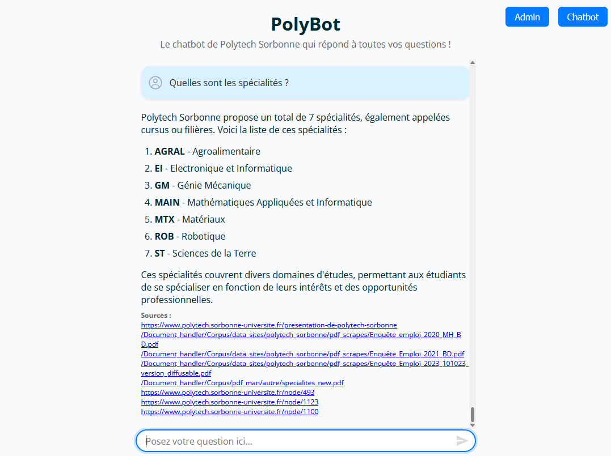

<div align="center">

# 🤖 Polytech Sorbonne - Chatbot RAG Intelligent

> **Un système de chatbot intelligent pour les étudiants de Polytech Sorbonne, propulsé par l'IA et la récupération de documents (RAG)**

[](https://python.org)
[](https://fastapi.tiangolo.com)
[](https://react.dev)
[](https://langchain.com)
[](https://chromadb.com)
[](https://sqlite.org)



</div>

---

## 🚀 Aperçu

**Chatbot RAG intelligent** utilisant l'IA pour fournir des réponses précises à toute personne souhaitant obtenir des informations sur Polytech Sorbonne : futurs étudiants (lycéens), parents, élèves actuels ou toute personne intéressée. Le système analyse automatiquement l'intention des questions et oriente les requêtes vers les meilleures stratégies de récupération.

## ✨ Fonctionnalités Clés

- 🧠 **Analyse d'intention intelligente** - Classification automatique des questions
- 🔀 **Routage adaptatif** - Stratégies de récupération optimisées
- 📊 **Monitoring avancé** - Tracking des coûts et performances
- 🔐 **Sécurité intégrée** - Rate limiting et authentification
- ⚡ **Réponses temps réel** - Interface chat moderne

## ⚡ Installation Rapide

```bash
# TODO: tester l'instalation
# 1. Cloner le projet
git clone https://github.com/Adr44mo/Stage-Chatbot-Polytech.git
cd Stage-Chatbot-Polytech

# 2. Configuration
cp .env.example .env
# Ajouter votre clé OpenAI dans .env

# 3. Installation des dépendances
pip install -r Fastapi/backend/requirements.txt
cd Fastapi/frontend && npm install

# 4. Démarrage automatique
chmod +x start.sh
./start.sh
```

## 📊 Architecture

### 🏗️ Vue d'ensemble du Projet

<div align="center">
  
  <p><em>Architecture complète : Sources, Backend, Frontend</em></p>
</div>

### 🔧 Architecture Simplifiée

<div align="center">
  
  <p><em>Vue simplifiée des trois composants principaux</em></p>
</div>

### 🔄 Workflow LangGraph

<div align="center">
  
  <p><em>Processus de traitement des documents avec LangGraph</em></p>
</div>

## 🛠️ Stack Technique

**Backend** : FastAPI • LangChain • ChromaDB • SQLite • OpenAI • Redis  
**Frontend** : React 19 • TypeScript • Vite  
**Infrastructure** : Docker • Nginx • Python 3.12

**Accès** : http://localhost:5173

## 📚 Documentation Complète

### 📖 Guide Principal
- **[📚 Wiki du Projet](https://github.com/Adr44mo/Stage-Chatbot-Polytech/wiki)** - Documentation complète
- **[🚀 Guide d'Installation](https://github.com/Adr44mo/Stage-Chatbot-Polytech/wiki/Installation)** - Setup détaillé
- **[🔧 Configuration](https://github.com/Adr44mo/Stage-Chatbot-Polytech/wiki/Configuration)** - Paramètres avancés

### 🔧 Développement
- **[🏗️ Architecture](https://github.com/Adr44mo/Stage-Chatbot-Polytech/wiki/Architecture)** - Structure technique

### 📊 Utilisation
- **[👤 Guide Utilisateur](https://github.com/Adr44mo/Stage-Chatbot-Polytech/wiki/Guide-Utilisateur)** - Manuel utilisateur
- **[🌐 API Reference](https://github.com/Adr44mo/Stage-Chatbot-Polytech/wiki/API-Reference)** - Documentation API

## 🎯 Utilisation Rapide

### Types de Questions Supportées

| Type | Exemple |
|------|---------|
| **Cours** | *"Objectifs du cours d'Algorithmique ?"* |
| **Spécialité** | *"Tous les cours de robotique"* |
| **Général** | *"Témoignages d'étudiants"* |
| **Vie étudiante** | *"Activités disponibles"* |

### API Endpoints

```bash
# Chat standard
curl -X POST "http://localhost:8000/chat" \
  -H "Content-Type: application/json" \
  -d '{"prompt": "Cours de robotique ?", "chat_history": []}'

# Statistiques
curl "http://localhost:8000/intelligent-rag/database/statistics"
```

## 📈 Performance

- **Temps de réponse** : 5-15 secondes
- **Coût/question** : ~$0.002-0.005


## 📄 Licence

Ce projet est sous licence **MIT**. Voir [LICENSE](LICENSE) pour plus de détails.

## 👥 Équipe

- **Développeur** : [Adr44mo](https://github.com/Adr44mo) 
- **Institution** : [Polytech Sorbonne](https://www.polytech.sorbonne-universite.fr/), [LIMICS](https://www.limics.fr/)
---

<div align="center">
  <sub>Développé avec ❤️ pour les étudiants de Polytech Sorbonne</sub>
  <br>
  <sub>Propulsé par OpenAI, LangChain, et l'intelligence artificielle</sub>
</div>