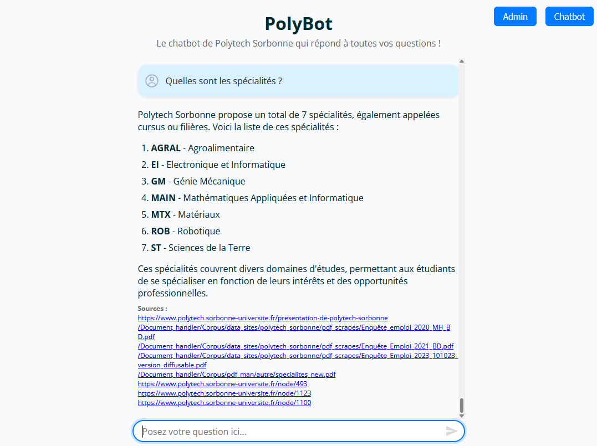
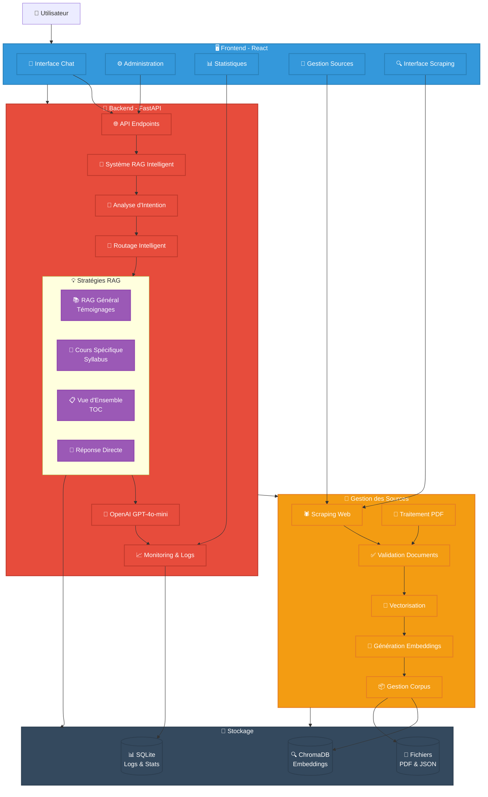

# Polytech Sorbonne - Chatbot RAG Intelligent

> **Un système de chatbot intelligent pour les étudiants de Polytech Sorbonne, propulsé par l'IA et la récupération de documents (RAG)**

---

## Aperçu

**Chatbot RAG intelligent** utilisant l'IA pour fournir des réponses précises à toute personne souhaitant obtenir des informations sur Polytech Sorbonne : futurs étudiants (lycéens), parents, élèves actuels ou toute personne intéressée. Le système analyse automatiquement l'intention des questions et oriente les requêtes vers les meilleures stratégies de récupération.

## Fonctionnalités Clés

- **Analyse d'intention intelligente** - Classification automatique des questions
- **Routage adaptatif** - Stratégies de récupération optimisées
- **Monitoring avancé** - Tracking des coûts et performances
- **Sécurité intégrée** - Rate limiting et authentification

## Installation

Pour l’installation et le déploiement détaillé, voir le guide : [DEPLOYMENT.md](./DEPLOYMENT.md)

## Architecture

## Stack Technique

**Backend** : FastAPI • LangChain • ChromaDB • SQLite • OpenAI • Redis  
**Frontend** : React 19 • TypeScript • Vite  
**Infrastructure** : Nginx • Python 3.12

## Documentation Complète

### 📖 Guide Principal
- **[📚 Wiki du Projet](https://github.com/Adr44mo/Stage-Chatbot-Polytech/wiki)** - Documentation complète
- **[🚀 Guide d'Installation](https://github.com/Adr44mo/Stage-Chatbot-Polytech/wiki/Installation)** - Setup détaillé
- **[🔧 Configuration](https://github.com/Adr44mo/Stage-Chatbot-Polytech/wiki/Configuration)** - Paramètres avancés

### Développement
- **[🏗️ Architecture](https://github.com/Adr44mo/Stage-Chatbot-Polytech/wiki/Architecture)** - Structure technique

### Utilisation
- **[👤 Guide Utilisateur](https://github.com/Adr44mo/Stage-Chatbot-Polytech/wiki/Guide-Utilisateur)** - Manuel utilisateur
- **[🌐 API Reference](https://github.com/Adr44mo/Stage-Chatbot-Polytech/wiki/API-Reference)** - Documentation API

## 📄 Licence

Ce projet est sous licence **MIT**. Voir [LICENSE](LICENSE) pour plus de détails.

## 👥 Équipe

- **Développeur** : [Adr44mo](https://github.com/Adr44mo) 
- **Institution** : [Polytech Sorbonne](https://www.polytech.sorbonne-universite.fr/), [LIMICS](https://www.limics.fr/)
---

  Développé avec ❤️ pour les étudiants de Polytech Sorbonne
   
  Propulsé par OpenAI, LangChain, et l'intelligence artificielle

